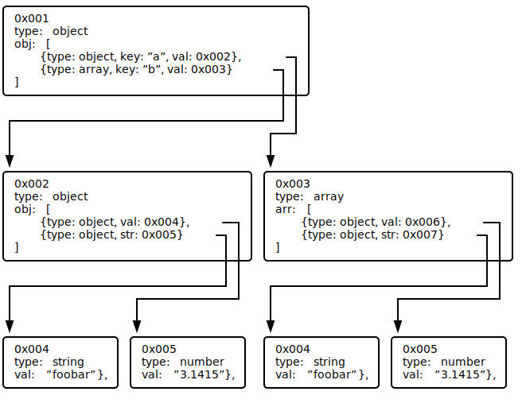

# Vector API

Provide Vector API for vector parsers.

The main idea: popular data interchange formats (such as JSON, XML, ...) stores data as a tree.
Parsers of that formats reproduces that tree in a memory somehow or other. Moreover, each of them makes a copy of source
data, it's often is redundant. This makes a lot of pointers in the heap and GC does a lot of work during marking.

This parser uses different way: it stores all parsed nodes (key-value pairs) in a special array (vector). Instead of
pointers to child nodes, each node stores adjacency list of indices of childs. In fact, to reduce pointers node stores
not and array of indices, but offset/length of child indices in special struct calls `Index` (see below).

Thus, the main purpose of the whole project is minimising of pointers and thereby cut the costs of GC work.
An additional purpose if memory economy.

Let's check difference of that approaches on example:
Source document:
```json
{
  "a":{"c":"foobar","d":3.1415},
  "b":["asdfgh","zxcvb"]
}
```

Typical parse will make a tree in memory like this:


, each node will an instance of struct like this:
```go
type Node struct {
	typ Type    // [null, object, array, string, number, true, false]
	obj Object  // one pointer to slice and N*2 pointers inside KeyValue struct, see below
	arr []*Node // one pointer for the slice and N pointers for each array item
	str string  // one pointer
}

type Object []KeyValue

type KeyValue struct {
	key string // one pointer
	val *Node  // one pointer to node
}
```

That way produces a too many pointers and on complex source document that count will grow even more.

Vector in memory will look like:


Looks redundant and strange, isn't it? But that way allow for any type of source document produces constant number of
pointers:
* one for array of nodes
* one for index
* one for each row in index

In fact, node struct if more complex that present on the picture. Key/value isn't a bit-shifted lo/hi indices in source
data, but special struct [Byteptr](byteptr.go). It stores additionally raw (uintptr) "pointer" to source data and extra
flags. But the idea is the same: in GC eyes, both byteptr and node is simple structs and GC will not spend time to check
them.
