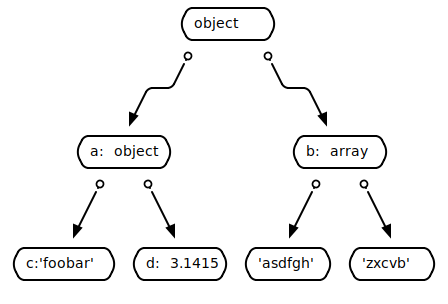
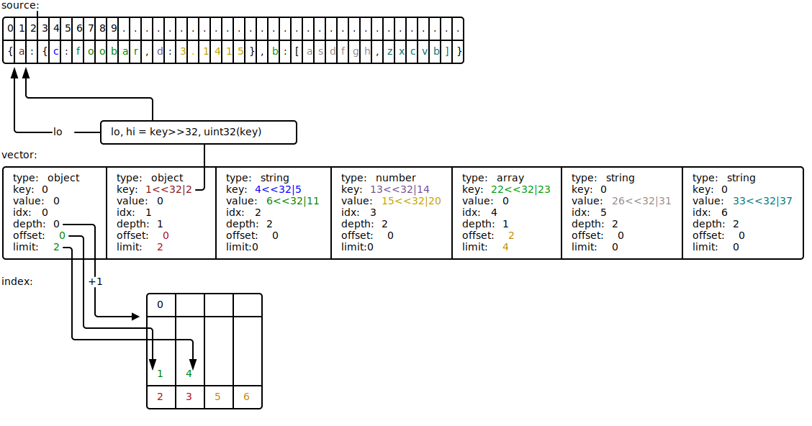

# Vector API

Описывает API для векторных парсеров.

Главная идея: популярные форматы обмена данными (такие как JSON, XML, ...) хранят данные в виде дерева. А все популярные
парсеры воспроизводят это дерево в памяти приложения. Более того, они создают копию исходных данных внутри себя и это
приводит к перерасходу памяти. В комплексе это приводит к тому, что в памяти накапливается большое количество
указателей и GC делает много дополнительной работы при маркировке.

Этот парсер действует иначе: любые ноды (объект, массив, пары ключ-значение, ...) хранятся не в дереве, а в специальном
массиве (векторе). Вместо указателей на дочерние ноды используются индексы дочерних нод в векторе, иными словами каждая
нода хранит список смежности дочерних нод. В реальности всё несколько иначе: список индексов дочерних нод хранится не
внутри самой ноды (чтобы не плодить указатели), а в специальной структуре Index, это будет рассмотрено далее.

Таким образом главная главная цель всего проекта заключается в том, чтобы минимизировать количество указателей в памяти,
и, тем самым, сократить издержки на работу GC. Дополнительной целью является минимизация использования памяти.

Сравним эти два подхода на конкретном примере. Пусть мы имеем JSON документ:
```json
{
  "a":{"c":"foobar","d":3.1415},
  "b":["asdfgh","zxcvb"]
}
```

Типичный парсер создаст в памяти дерево вида:


, где каждый узел будет являться структурой:
```go
type Node struct {
	typ Type    // [null, object, array, string, number, true, false]
	obj Object  // one pointer to slice and N*2 pointers inside KeyValue struct, see below
	arr []*Node // one pointer for the slice and N pointers for each array item
	str string  // one pointer
}

type Object []KeyValue

type KeyValue struct {
	key string // one pointer
	val *Node  // one pointer to node
}
```

Нетрудно заметить, что такая структура плодит чересчур много указателей и с ростом сложности исходного документа их будет
всё больше.

Вектор в пямяти будет выглядеть следующим образом:


Выглядит громоздко и странно, не так ли? Но такая структура позволяет для любого варианта исходных данных иметь всего
несколько указателей в векторе:
* один на сам массив (вектор) нод
* один на индекс
* плюс по одному на каждую строку в индексе

Таким образом если считать "сложность структуры по указателям", то она будет константной, в то время как у классических
парсеров, она будет в лучшем случае линейной.

В действительности структура нод вектора сложнее чем представленная на диаграмме. Ключ/значение являются не числом, где
с помощью побитовых сдвигов хранятся lo/hi индексы в исходных данных, а структурой [Byteptr](byteptr.go). Она позволяет
хранить не только lo/hi индексы, но и raw (uintptr) указатели на данные и дополнительные флаги. Но суть остаётся
неизменной: с точки зрения GC, что byteptr, что нода это просто структура без всяких указателей и он не будет тратить
время на их проверку.

## API

### Парсинг

Vector API предоставляет 4 метода для парсинга:
```go
func (Vector) Parse([]byte) error
func (Vector) ParseCopy([]byte) error
func (Vector) ParseString(string) error
func (Vector) ParseCopyString(string) error
```
copy-версии позволяют явно сделать копию исходных данных внутри вектора. По умолчанию копирование не происходит и ноды
указывают на память вне вектора. Обязанностью разработчика является обеспечить сохранность данных на протяжении всей
жизни вектора. Если сделать это невозможно, то лучше воспользоваться copy-методом, это безопаснее.

Одной из эксклюзивных особенностей vector API является возможность парсить одним объектом вектора сразу много исходных
документов:
```go
vec.ParseString(`{"a":{"b":{"c":"foobar"}}}`)
vec.ParseString(`{"x":{"y":{"z":"asdfgh"}}}`)
s0 := vec.RootByIndex(0).DotString("a.b.c")
s1 := vec.RootByIndex(1).DotString("x.y.z")
println(s0, s1) // foobar asdfgh
```
Таким образом, при необходимости парсить много мелких исходных документов, вектор позволяет свести количество указателей
к такому минимуму, как если бы парсился всего один документ.

### Чтение данных

Самыми базовыми методами чтения данных в vector API являются:
```go
func (Vector) Get(path ...string) *Node
func (Vector) GetObject(path ...string) *Node
func (Vector) GetArray(path ...string) *Node
func (Vector) GetBytes(path ...string) []byte
func (Vector) GetString(path ...string) string
func (Vector) GetBool(path ...string) bool
func (Vector) GetFloat(path ...string) (float64, error)
func (Vector) GetInt(path ...string) (int64, error)
func (Vector) GetUint(path ...string) (uint64, error)
```
По variadic пути эти методы позволяют получить или ноду или сразу нужное значением (типы в исходных данных должны совпадать
, например метод `GetInt` вернёт число только в том случае, если по `path` в исходном документе лежит именно
челочисленное число).

vector API также позволяет задавать получать данные, не используя variadic переменную пути:
```go
func (Vector) GetPS(path, separator string) *Node
func (Vector) GetObjectPS(path, separator string) *Node
func (Vector) GetArrayPS(path, separator string) *Node
func (Vector) GetBytesPS(path, separator string) []byte
func (Vector) GetStringPS(path, separator string) string
func (Vector) GetBoolPS(path, separator string) bool
func (Vector) GetFloatPS(path, separator string) (float64, error)
func (Vector) GetIntPS(path, separator string) (int64, error)
func (Vector) GetUintPS(path, separator string) (uint64, error)
```
Пример:
```go
vec.ParseString(`{"a":{"b":{"c":"foobar"}}}`)
s := vec.GetStringPS("a.b.c", ".")
println(s) // foobar
```

Т.к. наиболее популярным разделителем является точка (`"."`), то vector API предоставляет удобные алиас-методы:
```go
func (Vector) Dot(path string) *Node
func (Vector) DotObject(path string) *Node
func (Vector) DotArray(path string) *Node
func (Vector) DotBytes(path string) []byte
func (Vector) DotString(path string) string
func (Vector) DotBool(path string) bool
func (Vector) DotFloat(path string) (float64, error)
func (Vector) DotInt(path string) (int64, error)
func (Vector) DotUint(path string) (uint64, error)
```
Пример:
```go
vec.ParseString(`{"a":{"b":{"c":"foobar"}}}`)
s := vec.DotString("a.b.c")
println(s) // foobar
```
Это просто удобный синтаксический сахар, чтобы не указывать самый популярный разделитель.

### Сериализация

vector API позволяет выполнить обратную операцию - из распарсенных данных собрать документ обратно:
```go
func (Vector) Beautify(io.Writer) error
func (Vector) Marshal(io.Writer) error
```

`Beautify` метод записывает в writer человеко-читаемую форму документа с переносами строк и отступами, а `Marshal` -
минимизированную.

### Обработка ошибок

vector может вернуть ошибку при парсинге данных. Чаще всего понять конкретное место непросто, т.к. ошибка
"unexpected identifier" может произойти где угодно. В этом случае может помочь метод:
```go
func (Vector) ErrorOffset() int
```
С его помощью можно будет легко найти нужное место в исходном документе.

### Итерирование

Если вектором распарсили больше одного документа, то обойти их можно не используя `RootByIndex` метод:
```go
func (Vector) Each(fn func(int, *Node))
```
Пример:
```go
vec.ParseString(`{"a":{"b":{"c":"foobar"}}}`)
vec.ParseString(`{"x":{"y":{"z":"asdfgh"}}}`)
vec.Each(func(i int, node *Node) {
	node.Get("...")
})
```

## Node API

### Чтение данных

Аналогично vector API, есть три группы методов:
* Get-методы
* GetPS-методы
* Dot-методы

В дополнение, нода может возвращать отдельно ключ/значение в виде [Byteptr](byteptr.go) объектов:
```go
func (Node) Key() *Byteptr
func (Node) Value() *Byteptr
```
или сразу конвертировать ключ/значение в типы:
```go
// key
func (Node) KeyBytes() []byte
func (Node) KeyString() string
// value
func (Node) Bytes() []byte
func (Node) ForceBytes() []byte
func (Node) RawBytes() []byte
func (Node) String() string
func (Node) ForceString()
func (Node) Bool() bool
func (Node) Float() (float64, error)
func (Node) Int() (int64, error)
func (Node) Uint() (uint64, error)
func (Node) Object() *Node
func (Node) Array() *Node

func (Node) Type() Type
func (Node) Exists(key string) bool
```

### Итерирование

Если нода имеет тип объект или массив, то пройтись по дочерним нодам можено методом:
```go
func (Node) Each(fn func(idx int, node *Node))
```

### Сортировка

Ноды типа объект или массив могут сортировать свои дочерние элементы:
```go
func (Node) SortKeys() *Node // по ключу
func (Node) Sort() *Node     // по значению
```

### Удаление

Ноды поддерживают предикатное удаление:
```go
func (Node) RemoveIf(cond func(idx int, node *Node) bool)
```

### Дочерние ноды

```go
func (Node) Children() []Node
func (Node) ChildrenIndices() []int
```

### Сериализация

Сериализация устроена аналогично vector API, но позволяет затронуть только текущую ноду и ещё дочерние ноды (рекурсивно):
```go
func (Node) Beautify(io.Writer) error
func (Node) Marshal(io.Writer) error
```

Таким образом, можно сериализовать не весь докучмент целиком, а только нужную его часть.

## Helper

Очень важная часть API. В рамках vector API это интерфейс:
```go
type Helper interface {
	Indirect(*Byteptr) []byte        // in-place unescape
	Beautify(io.Writer, *Node) error
	Marshal(io.Writer, *Node) error 
}
```
Т.к. vector API это общее решение для парсеров, то конкретные реализации этого интерфейса обеспечивают де-экранирование
и сериализацию для конкретных форматов данных ([JSON](https://github.com/koykov/jsonvector/blob/master/helper.go),
[XML](https://github.com/koykov/xmlvector/blob/master/helper.go), ...).
 
Замечу, что де-экранирование происходит in-place и дополнительная память для этого не нужна.
