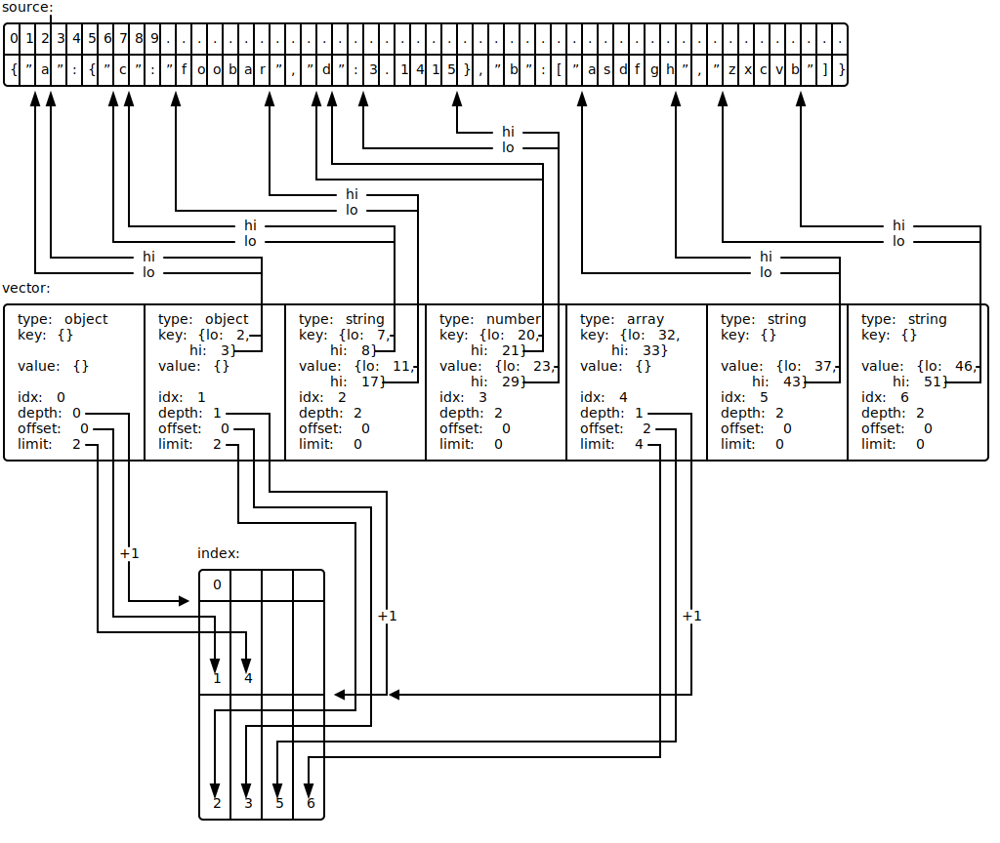

# Vector API

Описывает API для векторных парсеров.

Главная идея: популярные форматы обмена данными (такие как JSON, XML, ...) хранят данные в виде дерева. А все популярные
парсеры воспроизводят это дерево в памяти приложения. В комплексе это приводит к тому, что в памяти накапливается
большое количество указателей и GC делает много дополнительной работы при маркировке. Более того, они создают копию
исходных данных внутри себя и это приводит к перерасходу памяти.

Этот парсер действует иначе: любые ноды (объект, массив, пары ключ-значение, ...) хранятся не в дереве, а в специальном
массиве (векторе). Вместо указателей на дочерние ноды используются индексы дочерних нод в векторе, иными словами каждая
нода хранит список смежности дочерних нод. В реальности всё несколько иначе: список индексов дочерних нод хранится не
внутри самой ноды (чтобы не плодить указатели), а в специальной структуре `Index`, это будет рассмотрено далее.

Таким образом главная главная цель всего проекта заключается в том, чтобы минимизировать количество указателей в памяти,
и, тем самым, сократить издержки на работу GC. Дополнительной целью является минимизация использования памяти.

Сравним эти два подхода на конкретном примере. Пусть мы имеем JSON документ:
```json
{
  "a":{"c":"foobar","d":3.1415},
  "b":["asdfgh","zxcvb"]
}
```

Типичный парсер создаст в памяти дерево вида:

> **_NOTE:_**  Каждая стрелка на рисунке является указателем, равно как и каждая непустая строка внутри нод.

, где каждый узел будет являться структурой:
```go
type Node struct {
	typ Type    // [null, object, array, string, number, true, false]
	obj Object  // one pointer to slice and N*2 pointers inside KeyValue struct, see below
	arr []*Node // one pointer for the slice and N pointers for each array item
	str string  // one pointer
}

type Object []KeyValue

type KeyValue struct {
	key string // one pointer
	val *Node  // one pointer to node
}
```

Нетрудно заметить, что такая структура плодит чересчур много указателей и с ростом сложности исходного документа их будет
всё больше.

Вектор в пямяти будет выглядеть следующим образом:

> **_NOTE:_**  В противоположность прошлому рисунку, тут стрелки являются не указателями, а просто числовыми индексами.

Выглядит громоздко и странно, не так ли? Но такая структура позволяет для любого варианта исходных данных иметь всего
несколько указателей в векторе:
* один на сам массив (вектор) нод
* один на индекс
* плюс по одному на каждую строку в индексе

Это преимущество имеет свою цену - написане нового парсера с использованием vector API это нетривиальная задача. Также
дебаг вектора весьма сложен, т.к. дебаггер показывает вместо данных (например строк) отступы и длину в массивах, но не
сами данные.

## API

### Парсинг

Vector API предоставляет 4 метода для парсинга:
```go
func (Vector) Parse(source []byte) error
func (Vector) ParseCopy(source []byte) error
func (Vector) ParseString(source string) error
func (Vector) ParseCopyString(source string) error
```
Copy-версии позволяют явно сделать копию исходных данных внутри вектора. По умолчанию копирование не происходит и ноды
указывают на память вне вектора. Обязанностью разработчика является обеспечить сохранность данных на протяжении всей
жизни вектора. Если сделать это невозможно, то лучше воспользоваться copy-методом, это безопаснее.

Одной из эксклюзивных особенностей vector API является возможность парсить одним объектом вектора сразу много исходных
документов:
```go
vec.ParseString(`{"a":{"b":{"c":"foobar"}}}`)
vec.ParseString(`{"x":{"y":{"z":"asdfgh"}}}`)
s0 := vec.RootByIndex(0).DotString("a.b.c")
s1 := vec.RootByIndex(1).DotString("x.y.z")
println(s0, s1) // foobar asdfgh
```
Таким образом, при необходимости парсить много мелких исходных документов, вектор позволяет свести количество указателей
к такому минимуму, как если бы парсился всего один документ.

### Чтение данных

Самыми базовыми методами чтения данных в vector API являются:
```go
func (Vector) Get(path ...string) *Node
func (Vector) GetObject(path ...string) *Node
func (Vector) GetArray(path ...string) *Node
func (Vector) GetBytes(path ...string) []byte
func (Vector) GetString(path ...string) string
func (Vector) GetBool(path ...string) bool
func (Vector) GetFloat(path ...string) (float64, error)
func (Vector) GetInt(path ...string) (int64, error)
func (Vector) GetUint(path ...string) (uint64, error)
```
По variadic пути эти методы позволяют получить или ноду или сразу нужное значением (типы в исходных данных должны совпадать
, например метод `GetInt` вернёт число только в том случае, если по `path` в исходном документе лежит именно
целочисленное число).

vector API также позволяет получать данные без использования variadic переменной пути:
```go
func (Vector) GetPS(path, separator string) *Node
func (Vector) GetObjectPS(path, separator string) *Node
func (Vector) GetArrayPS(path, separator string) *Node
func (Vector) GetBytesPS(path, separator string) []byte
func (Vector) GetStringPS(path, separator string) string
func (Vector) GetBoolPS(path, separator string) bool
func (Vector) GetFloatPS(path, separator string) (float64, error)
func (Vector) GetIntPS(path, separator string) (int64, error)
func (Vector) GetUintPS(path, separator string) (uint64, error)
```
Пример:
```go
vec.ParseString(`{"a":{"b":{"c":"foobar"}}}`)
s := vec.GetStringPS("a.b.c", ".")
println(s) // foobar
```

Т.к. наиболее популярным разделителем является точка (`"."`), то vector API предоставляет удобные алиас-методы:
```go
func (Vector) Dot(path string) *Node
func (Vector) DotObject(path string) *Node
func (Vector) DotArray(path string) *Node
func (Vector) DotBytes(path string) []byte
func (Vector) DotString(path string) string
func (Vector) DotBool(path string) bool
func (Vector) DotFloat(path string) (float64, error)
func (Vector) DotInt(path string) (int64, error)
func (Vector) DotUint(path string) (uint64, error)
```
Пример:
```go
vec.ParseString(`{"a":{"b":{"c":"foobar"}}}`)
s := vec.DotString("a.b.c")
println(s) // foobar
```
Это просто удобный синтаксический сахар, чтобы не указывать самый популярный разделитель.

### Сериализация

vector API позволяет выполнить обратную операцию - из распарсенных данных собрать документ обратно:
```go
func (Vector) Beautify(writer io.Writer) error
func (Vector) Marshal(writer io.Writer) error
```

`Beautify` метод записывает в writer человеко-читаемую форму документа с переносами строк и отступами, а `Marshal` -
минимизированную.

### Обработка ошибок

vector может вернуть ошибку при парсинге данных. Чаще всего понять конкретное место непросто, т.к. ошибка
"unexpected identifier" может произойти где угодно. В этом случае может помочь метод:
```go
func (Vector) ErrorOffset() int
```
С его помощью можно будет легко найти нужное место в исходном документе.

### Итерирование

Если вектором распарсили больше одного документа, то обойти их можно не используя `RootByIndex` метод:
```go
func (Vector) Each(fn func(index int, node *Node))
```
Пример:
```go
vec.ParseString(`{"a":{"b":{"c":"foobar"}}}`)
vec.ParseString(`{"x":{"y":{"z":"asdfgh"}}}`)
vec.Each(func(i int, node *Node) {
	node.Get("...")
})
```

## Node API

### Чтение данных

Аналогично vector API, есть три группы методов:
* Get-методы
* GetPS-методы
* Dot-методы

В дополнение, нода может возвращать отдельно ключ/значение в виде [Byteptr](byteptr.go) объектов:
```go
func (Node) Key() *Byteptr
func (Node) Value() *Byteptr
```
или сразу конвертировать ключ/значение в типы:
```go
// key
func (Node) KeyBytes() []byte
func (Node) KeyString() string
// value
func (Node) Bytes() []byte
func (Node) ForceBytes() []byte
func (Node) RawBytes() []byte
func (Node) String() string
func (Node) ForceString()
func (Node) Bool() bool
func (Node) Float() (float64, error)
func (Node) Int() (int64, error)
func (Node) Uint() (uint64, error)
func (Node) Object() *Node
func (Node) Array() *Node

func (Node) Type() Type
func (Node) Exists(key string) bool
```

### Итерирование

Если нода имеет тип объект или массив, то пройтись по дочерним нодам можно методом:
```go
func (Node) Each(fn func(index int, node *Node))
```

### Сортировка

Ноды типа объект или массив могут сортировать свои дочерние элементы:
```go
func (Node) SortKeys() *Node // по ключу
func (Node) Sort() *Node     // по значению
```

### Удаление

Ноды поддерживают предикатное удаление:
```go
func (Node) RemoveIf(cond func(index int, node *Node) bool)
```

### Дочерние ноды

```go
func (Node) Children() []Node
func (Node) ChildrenIndices() []int
```

### Сериализация

Сериализация устроена аналогично vector API, но позволяет затронуть только текущую ноду и ещё дочерние ноды (рекурсивно):
```go
func (Node) Beautify(writer io.Writer) error
func (Node) Marshal(writer io.Writer) error
```

Таким образом, можно сериализовать не весь документ целиком, а только нужную его часть.

## Helper

Очень важная часть API. В рамках vector API это интерфейс:
```go
type Helper interface {
	Indirect(ptr *Byteptr) []byte        // in-place unescape
	Beautify(writer io.Writer, node *Node) error
	Marshal(writer io.Writer, node *Node) error 
}
```
Т.к. vector API это общее решение для парсеров, то конкретные реализации этого интерфейса обеспечивают де-экранирование
и сериализацию для конкретных форматов данных ([JSON](https://github.com/koykov/jsonvector/blob/master/helper.go),
[XML](https://github.com/koykov/xmlvector/blob/master/helper.go), ...).
 
Замечу, что де-экранирование происходит in-place и дополнительная память для этого не нужна.

## Пулинг

vector изначально разрабатывался как highload решение и поэтому использовать его следует только через пулинг:
```go
vec := jsonvector.Acquire()
defer jsonvector.Release(vec)
// or
vec := xmlvector.Acquire()
defer xmlvector.Release(vec)
// ...
```

Сам пакет vector возможности пулинга не предоставляет, т.к. это просто общее API, но в производных пакетах существуют
`Acquire`/`Release` методы, которые работают с `sync.Pool` неявно.

В действительности, никто не мешает использовать векторы в ненагруженных частях кода. В этом случае пулингом можно
пренебречь:
```go
vec := jsonvector.NewVector()
// or
vec := xmlvector.NewVector()
// ...
```

## Производительность

Написаны модули к versus-проекту для каждого из существующих векторных парсеров:
* https://github.com/koykov/versus/tree/master/jsonvector
* https://github.com/koykov/versus/tree/master/xmlvector
* https://github.com/koykov/versus/tree/master/urlvector
* https://github.com/koykov/versus/tree/master/halvector
* todo: yamlvector

Наибольший интерес представляет [jsonvector](https://github.com/koykov/versus/tree/master/jsonvector), т.к. у него были
достойные соперники, поэтому будем рассматривать только его.

### Тестовый датасет
* [small.json](https://github.com/koykov/versus/blob/master/jsonvector/testdata/small.json)
* [medium.json](https://github.com/koykov/versus/blob/master/jsonvector/testdata/medium.json)
* [large.json](https://github.com/koykov/versus/blob/master/jsonvector/testdata/large.json)
* [canada.json](https://github.com/koykov/versus/blob/master/jsonvector/testdata/canada.json)
* [citm_catalog.json](https://github.com/koykov/versus/blob/master/jsonvector/testdata/citm_catalog.json)
* [twitter.json](https://github.com/koykov/versus/blob/master/jsonvector/testdata/twitter.json)

### Тестовые стенды
* [i7-7700HQ](https://github.com/koykov/versus/blob/master/jsonvector/benchstat/i7-7700HQ--10n-5m--new.txt)
* [i7-1185G7](https://github.com/koykov/versus/blob/master/jsonvector/benchstat/i7-1185G7--10n-1m--new.txt)
* [Apple M2](https://github.com/koykov/versus/blob/master/jsonvector/benchstat/Apple-M2--10n-1m--new.txt)
* [Xeon 4214](https://github.com/koykov/versus/blob/master/jsonvector/benchstat/Xeon-4214--10n-1m--new.txt)

Все стенды, кроме Apple M2 работают под управлением Ubuntu 22.04, версия Go 1.22.

### Участники соревнования
* https://github.com/valyala/fastjson
* https://github.com/koykov/jsonvector
* https://github.com/minio/simdjson-go

### Результат

Самый интересный вариант, это серверный Xeon 4214, т.к. именно на похожих процессорах векторы работают в продакшне:

#### sec/op:
| DS/lib       | fastjson         | jsonvector       | simdjson         |
|--------------|------------------|------------------|------------------|
| small.json   | 31.61n ± 10%     | **30.21n ±  7%** | 162.2n ±  7%     | 
| medium.json  | **214.0n ±  9%** | 221.7n ±  2%     | 590.9n ±  8%     |
| large.json   | **2.452µ ±  1%** | 3.168µ ±  2%     | 5.910µ ± 14%     |
| canada.json  | 1.087m ±  3%     | 1.253m ±  0%     | **948.1µ ±  1%** |
| citm.json    | 375.2µ ±  1%     | 280.6µ ±  1%     | **212.0µ ±  4%** |
| twitter.json | 101.88µ ±  3%    | **80.80µ ±  1%** | 114.8µ ± 10%     |

#### B/s
| DS/lib       | fastjson          | jsonvector        | simdjson          |
|--------------|-------------------|-------------------|-------------------|
| small.json   | 5.598Gi ± 11%     | **5.858Gi ±  8%** | 1.091Gi ±  6%     | 
| medium.json  | **10.14Gi ± 10%** | 9.784Gi ±  2%     | 3.671Gi ±  8%     |
| large.json   | **10.68Gi ±  1%** | 8.267Gi ±  2%     | 4.431Gi ± 13%     |
| canada.json  | 1.928Gi ±  3%     | 1713.4Mi ±  0%    | **2.211Gi ±  1%** |
| citm.json    | 4.287Gi ±  1%     | 5.732Gi ±  1%     | **7.587Gi ±  4%** |
| twitter.json | 5.773Gi ±  3%     | **7.279Gi ±  1%** | 5.124Gi ±  9%     |

Результат примерно одинаковый, что для vector-а является хорошим достижением, т.к. его основное преимущество - работа
на перспективу и оптимизации по указателям. Сопоставимая скорость с прочими парсерами является дополнительным бонусом.
